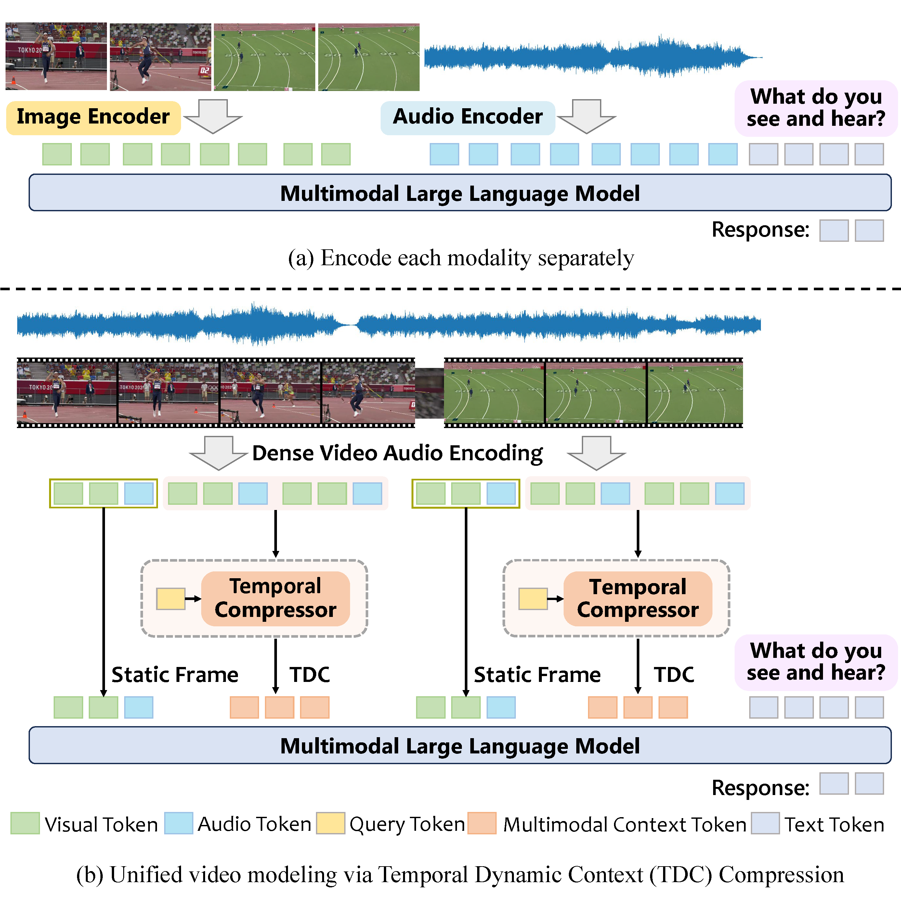
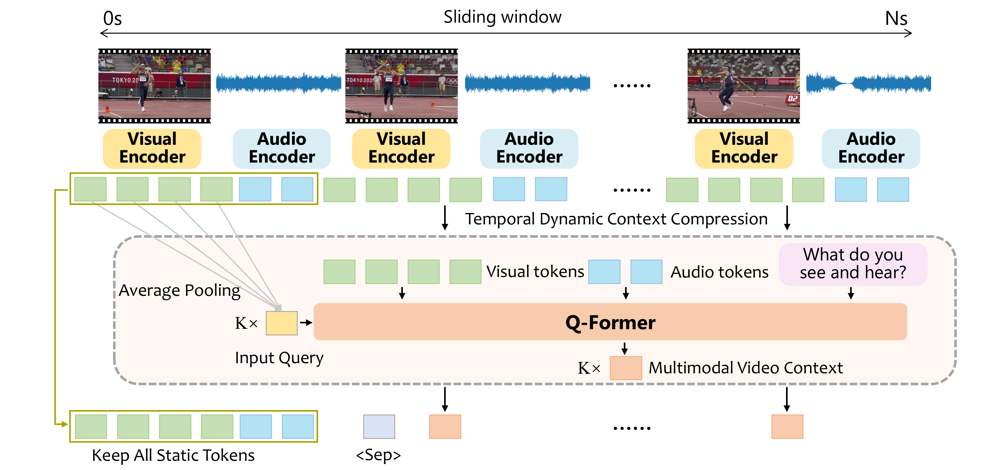

## Multimodal Long Video Modeling Based on Temporal Dynamic Context

### [Paper](https://arxiv.org/abs/2504.10443) | [Project Page](https://hoar012.github.io/TDC-Project/) | [Model](https://huggingface.co/Hoar012/TDC-Qwen2-7B)


## News
- **2025.7.16** Release model weights and inference code. Have a try!
- **2025.6.10** Release training and evaluation code.

<!-- ## Unified Multimodal Long Video Understanding
|  |
|:--:| -->


## 📋 Contents

- [Install](#install)
- [Models](#models)
- [Demo](#demo)
- [Training](#training)
- [Evaluation](#evaluation)


<!-- Note: 🚧 This repository is under construction 🚧 -- Please check back for updates! -->

## Framework of Temporal Dynamic Context Compression
|  |
|:--:|
| Architecture of Our Multimodal Video Encoder. We first extract features for each second of the video, including both visual and corresponding audio tokens. The first frame is selected as the static frame, and a Q-Former is used to perform Temporal Dynamic Context compression based on its relationship with subsequent frames, resulting in K compressed tokens per frame. The final video representation consists of all static frame tokens and multimodal video context. |

### Install

1. Clone the repo into a local folder.

```bash
git clone https://github.com/Hoar012/TDC-Video.git
cd TDC-Video
```

2. Install packages.

```bash
conda create -n tdc python=3.10 -y
conda activate tdc
pip install -r requirements.txt
pip install flash-attn --no-build-isolation
```

### Models
Pretrained model weights are available on Hugging Face.

TDC-Qwen2-7B: [TDC-Qwen2-7B](https://huggingface.co/Hoar012/TDC-Qwen2-7B); TDC-Llama3_2-3B: [TDC-Llama3_2-3B](https://huggingface.co/Hoar012/TDC-Llama3_2-3B)

### Demo

```bash
python main.py
```

### Training

1. Prepare training data

+ Stage 1: Image-Text Alignment: [LLaVA-OneVision-Single](https://huggingface.co/datasets/lmms-lab/LLaVA-OneVision-Data)
+ Stage 2: Video Instruction Tuning: [Stage2 data](https://huggingface.co/datasets/Hoar012/TDC_training_data/tree/main/stage2_data)
+ Stage 3: Audio-Video Instruction Tuning: [Stage3 data](https://huggingface.co/datasets/Hoar012/TDC_training_data/tree/main/stage3_data)

We also provide the processed videos and audios for stage 3 training: [Processed data](https://huggingface.co/datasets/Hoar012/TDC_training_data).

2. Start training

Modify the PATH_TO_JSON and PATH_TO_FOLDER arguments in the training scripts to your save folder.

```
PATH_TO_JSON=""
PATH_TO_FOLDER=""
```
Training your own model
+ Stage 1: Image-Text Alignment
```
sh scripts/stage1/train_image_qwen.sh
```

Modify PREV_STAGE_CHECKPOINT in the training scripts to your first stage model path

Change `image_token_len` and `query_num_list` in `config.json` to 144

+ Stage 2: Video Instruction Tuning
```
sh scripts/stage2/train_video_qwen.sh
```

+ Stage 3: Audio-Video Instruction Tuning
```
# Lora training
sh scripts/stage3/train_video_audio_qwen_lora.sh
```

### Evaluation

#### Evaluation on General Video Understanding
```bash
torchrun --nproc_per_node=8 ./eval/eval_mlvu.py --model_path Hoar012/TDC-Qwen2-7B --model_name cambrian_qwen --version qwen --data_path eval/MLVU
```

#### Evaluation on Audio-Visual Comprehension
```bash
torchrun --nproc_per_node=8 ./eval/eval_musicQA.py --model_path Hoar012/TDC-Qwen2-7B --model_name cambrian_qwen --version qwen --data_path data/AV_data/Music-AVQA --test_file data/AV_data/Music-AVQA/avqa-test.json
```

## BibTeX
```
@misc{hao2025multimodallongvideomodeling,
        title={Multimodal Long Video Modeling Based on Temporal Dynamic Context}, 
        author={Haoran Hao and Jiaming Han and Yiyuan Zhang and Xiangyu Yue},
        year={2025},
        eprint={2504.10443},
        archivePrefix={arXiv},
        primaryClass={cs.CV},
        url={https://arxiv.org/abs/2504.10443}, 
  }
```


## Acknowledgement

This repository is built upon: [LLaVA](https://github.com/haotian-liu/LLaVA), [LongVU](https://github.com/Vision-CAIR/LongVU) and [StoryTeller](https://github.com/hyc2026/storyteller).